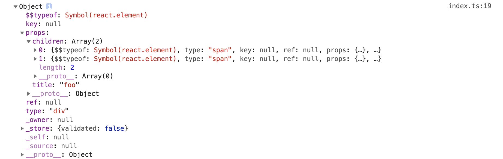

## 从零构建一个简单的 react

这篇文章会带领读者从零构建一个简单的 react，一共大概 300 行代码。其中包含了 react 的核心理念，例如：fibers、hooks、reconciliation。

这边文章专注实现 **React的方法组件** ，所以没有 Class组件相关的实现代码。

从头开始，以下是我们逐一添加到 React 版本中的所有内容：

- 第一步: createElement Function
- 第二步: render Function 渲染函数
- 第三步: Concurrent Mode 并发模式
- 第四步: Fibers
- 第五步: Render and Commit 阶段
- 第六步: Reconciliation 调和
- 第七步: Function Components 函数组件
- 第八步: Hooks

### 第一步：先谈谈 JSX

众所周知，`React` 的一大特色是 `JSX` 语法，它本质上是一个语法糖，类似 `XML` 的风格让 `JSX` 拥有更丰富的表现力。

例如下面的代码：

```tsx
const element = <div title='foo'>Hello</div>

// 等同于

const element = React.createElement(
  'div',
  { title: 'foo' },
  'Hello'
)
```

再查看一个嵌套的例子：

```tsx
const element = (<div title='foo'>
  <span id='a'>hello</span>
  <span id='b'>world</span>
</div>)

// 等同于

const element = React.createElement(
  'div',
  { title: 'foo' },
  React.createElement(
    'span',
    { id: 'a' },
    'hello'
  ),
  React.createElement(
    'span',
    { id: 'b' },
    'world'
  )
);
```

可以看到与使用原生 JS 相比， `JSX` 的表达更加简约直接，上面的例子可以直接运行，查看如下代码：

```ts
import React from 'react';
import ReactDOM from 'react-dom';

const element = React.createElement(
  'div',
  { title: 'foo' },
  React.createElement(
    'span',
    { id: 'a' },
    'hello'
  ),
  React.createElement(
    'span',
    { id: 'b' },
    'world'
  )
);

const container = document.getElementById('root');
ReactDOM.render(element, container);
```

运行 `yarn demo01` 可以查看效果。

> 解析 `JSX` 不在这篇文章要将的范畴，我们会借助类似 `babel` 这样的转换工具帮我们转换 `JSX`。

### 第二步：实现 createElement 方法

上面我们谈论 `JSX` 的时候，我们用到了 `React.createElement` 方法，它是干什么的呢？

我们在 **第一步** 的例子中打印个日志看一下它的数据结构，如下图：



其中 `props` 和 `type` 这两个属性比较关键，这两个属性会帮助我们构建完整的虚拟dom树。其中：

`type` 是一个字符串，我们用它来创建不同类型的 DOM 节点，例如 `div`、`span`、`h1`。

`props` 是一个对象，它具有 JSX 属性中的所有 key 和 value。另外，它还有一个特殊的属性：`children`，它又是与上面一样类型的对象，这也是为什么整个对象其实是一棵树。

如果用 `TypeScript` 来表示这个对象，可以写为：

```ts
export interface IFiber {
  type: string;
  props: {
    children?: IFiber[];
    [props: string]: any
  };
}
```

注意到这里以 `fiber` 为类型名，这里先不展开讲 `fiber`， 我们后续会更详细地介绍它。

言归正传，`createElement` 要做的事情很简单，就是根据入参转换出一个树结构出来，例如：

```tsx
const element = (<div title='foo'>
  <span id='a'>hello</span>
  <span id='b'>world</span>
</div>)

// 等同于

const element = MyReact.createElement(
  'div',
  { title: 'foo' },
  MyReact.createElement(
    'span',
    { id: 'a' },
    'hello'
  ),
  MyReact.createElement(
    'span',
    { id: 'b' },
    'world'
  )
);

// 等同于
const element = {
  type: 'div',
  props: {
    title: 'foo',
    children: [
      {
        type: 'span',
        props: {
          id: 'a',
          children: [
            {
              type: 'TEXT_ELEMENT',
              props: {
                nodeValue: 'hello',
                children: []
              }
            }
          ]
        }
      },
      {
        type: 'span',
        props: {
          id: 'b',
          children: [
            {
              type: 'TEXT_ELEMENT',
              props: {
                nodeValue: 'world',
                children: []
              }
            }
          ]
        }
      }
    ]
  }
};
```

注意到 `createElement` 会有三个或者更多入参，并且第三个参数后（包括第三个参数）都是其子元素，所以 `createElement` 的形参可以定义为：

```ts
createElement(type, props, ...children){
  // TODO
}
```

这样 `children` 其实就是包含所有子元素的数组。另外要注意，`children` 有可能包含原始数据类型，例如字符串，因此，我们需要将所有不是对象的 element 也包装成 element 对象，并为其创建特殊类型： `TEXT_ELEMENT`。

于是我们的 `createElement` 方法可以定义为：

```ts
function createElement(type: string, props, ...children) {
  return {
    type,
    props: {
      ...props,
      children: children.map(child =>
        typeof child === 'object'
          ? child
          : createTextElement(child)
      )
    }
  };
}

function createTextElement(text: string) {
  return {
    type: 'TEXT_ELEMENT',
    props: {
      nodeValue: text,
      children: []
    }
  };
}
```

运行 `yarn demo01` 可以查看效果。

### 第三步：实现 render 方法

TODO

### 相关链接

[Build your own React](https://pomb.us/build-your-own-react/)
[react-fiber-architecture](https://github.com/acdlite/react-fiber-architecture)
[React docs](https://zh-hans.reactjs.org/docs/reconciliation.html)
[烤透 React Hook](https://juejin.im/post/6867745889184972814)