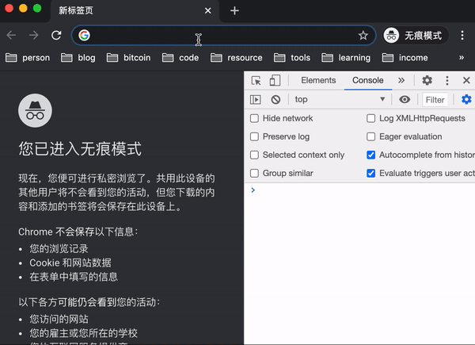
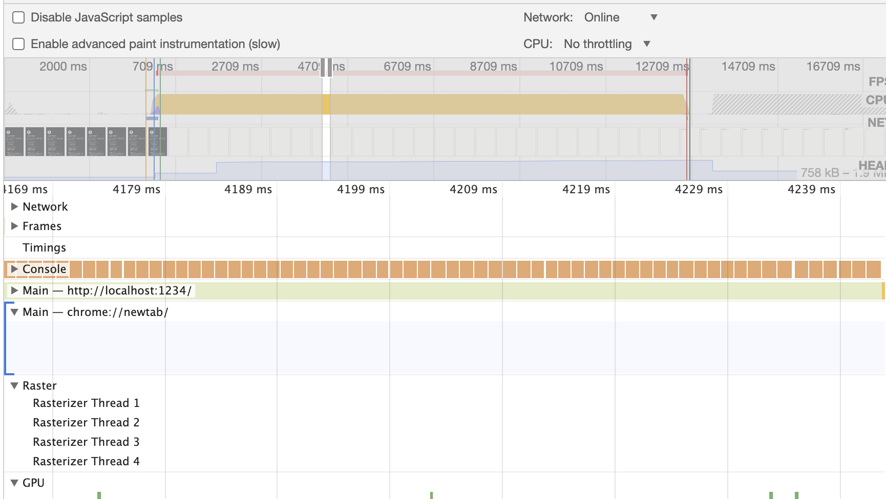
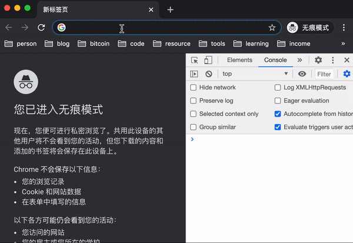
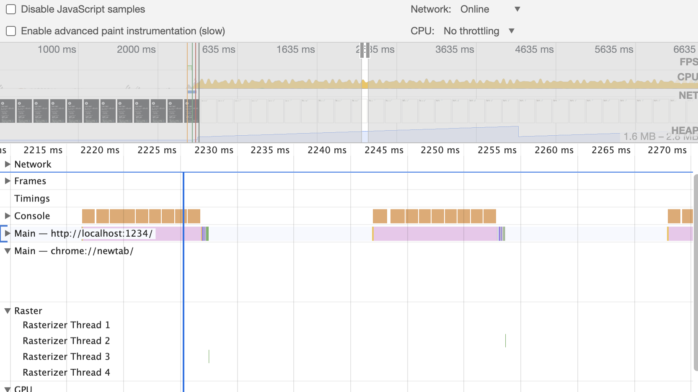
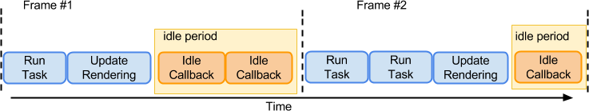
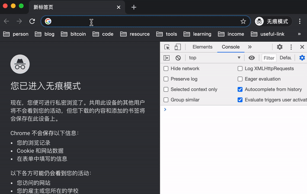
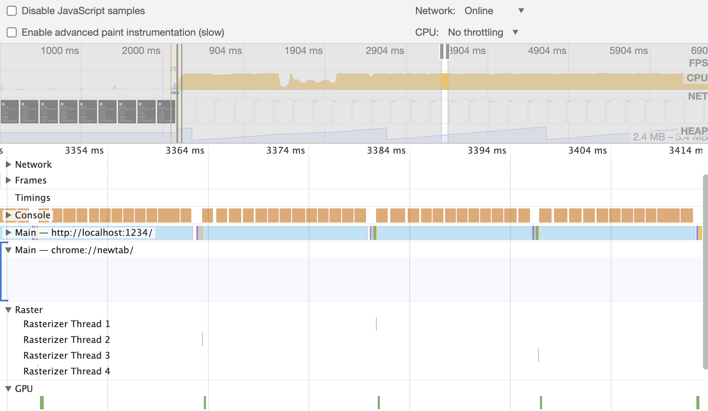
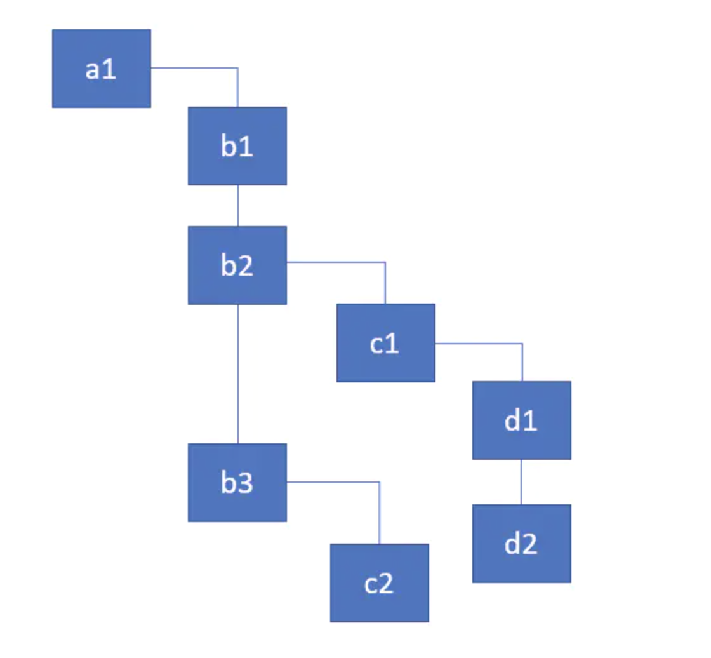
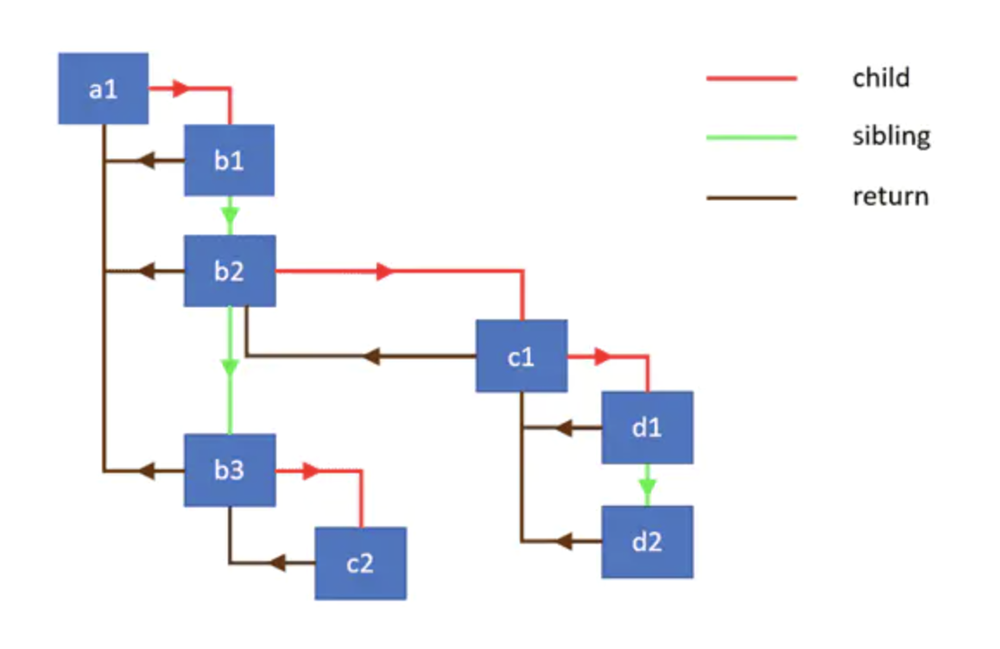

## React Fiber 是什么？

React 15 以及之前的版本有一个主要的问题 —— **虚拟 dom 的 diff 操作是同步完成的**。

这就意味着当页面上有大量 DOM 节点时，diff 的时间可能过长，从而导致交互卡顿，或者直接没有反馈。

这就引出了 React Fiber 来处理这样的问题。

### 这篇文章是什么？不是什么？

这篇文章将从一个简单的例子入手，主要聚焦于解释 **React Fiber 是怎么做到异步可中断更新的**。

这篇文章并不会深究 Fiber 中其他有趣的事情，例如 `workInProgress`、`Effects list`、`updateQueue`、`performUnitOfWork`、`render phase & commit phase`，这方面已经有足够优秀的文章帮我们弄清楚这些事情，感兴趣的同学可以阅读下面的文章列表：

- [Inside Fiber: in-depth overview of the new reconciliation algorithm in React](https://juejin.im/post/6844903844825006087)
- [React Fiber 源码解析](https://segmentfault.com/a/1190000023573713)
- [React issue 13186](https://github.com/facebook/react/issues/13186#issuecomment-403959161)
- [这可能是最通俗的 React Fiber 打开方式](https://juejin.im/post/6844903975112671239)

### 从一个问题开始

在讲 React Fiber 之前，我们先来看一个简单的例子：

**现在有 10000 个节点，每个节点计算耗时 1ms，如何保证 10000 个节点顺利执行完成，又能让用户感知不到卡顿？**

为了方便测试，我们用计算斐波那契数列来模拟节点耗时：

```ts
export function fibonacci(n) {
  if (n === 0) return 0;
  else if (n === 1) return 1;
  return fibonacci(n - 1) + fibonacci(n - 2);
}

export const fibonacciWithTime = (n) => {
  console.time('计算斐波那契数列');
  const res = fibonacci(n);
  console.timeEnd('计算斐波那契数列');
  return res;
};
```

先看看最坏的情况：

```ts
import { fibonacciWithTime } from './utils';

let count = 0;

const $root = document.getElementById('root');

function render(times) {
  while (count < times) {
    // 计算 25 的斐波那契数列大概耗时 1ms，所以这里选择 25
    fibonacciWithTime(25);
    count++;
    $root.innerText = '当前计算个数：' + count;
  }
}

render(10000);
```

页面会 "卡死" 10秒钟，期间用户的交互不会有任何反馈，而且页面不会有任何更新。只有这 10000 个节点执行完了，页面才会作出反馈。

运行 `yarn demo21` 查看效果：



这是因为 JavaScript 是单线程的，上面的代码长期占据 JavaScript 线程，导致其他动作无法执行。

查看调用栈会发现线程都被JS占满了：



解决这个问题主要有如下一些思路：

1. 提升计算机的算力，让计算机在极短的时间内就能完成更新操作。但是我们的应用可能跑在千差万别的设备上，总会有很多设备硬件水平不是很高。况且我们的应用将来会越来越复杂，dom 节点会越来越多，所以这个思路也没法从根本上解决问题。
1. 使用 web worker，让 diff 操作在另外一个线程中并行执行。这是个好思路，但是这可能会带来额外的开销，react 官方并没有采用这个策略，原因可以参考 [react issue 3092](https://github.com/facebook/react/issues/3092#issuecomment-183154290)。不过也有人在这个思路上做了不少[尝试](https://segmentfault.com/a/1190000016008108)
1. 将 diff 操作变成可中断的，只有当浏览器空闲时再做 diff。避免 diff 更新长时间占据浏览器线程。React Fiber 就是用的这个思路。

事实上，**我们要解决的其实并不是性能问题，而是调度问题**。用户的交互事件属于高优先级，需要尽快响应。而 diff 操作优先级相对没那么高，可以在几个时间段内分片执行。

接着上面的问题，我们应该如何优化？

聪明的读者会想到，我们可以自定义调度策略。例如一次执行 10 节点，然后空出 15ms 让浏览器做别的事情，以此循环。好想法，我们看看代码实现：

```ts
import { fibonacciWithTime } from './utils';

let count = 0;

const $root = document.getElementById('root');

function render(times) {
  setTimeout(() => {
    let currentCount = 1;
    while (count < times && currentCount < 10) {
      fibonacciWithTime(25);
      count++;
      currentCount++;
      $root.innerText = '当前计算个数：' + count;
    }
    render(times);
  }, 15);
}

render(10000);
```

可以看到运行的效果还是很流畅的，运行 `yarn demo22` 查看效果：



但是上面的调度策略虽然可用，但是也有一些问题。比如，假设计算节点变得复杂，需要 10ms 才能计算完一个，那么 10个节点就需要 100ms，这个时长用户就能感知到卡顿。再比如，留给浏览器的 15ms 浏览器可能根本用不到，导致render时间变长。

查看其调用栈会发现线程中浪费了大量的空闲时间：



有没有更好的方式呢？翻一翻浏览器的 API，[`requestIdleCallback`](https://developer.mozilla.org/zh-CN/docs/Web/API/Window/requestIdleCallback) 进入我们眼帘。

`requestIdleCallback` 方法将在浏览器的空闲时段内调用函数。这使开发者能够在主事件循环上执行后台和低优先级工作，而不会影响延迟关键事件，如动画和输入响应。

什么是空闲时段？当浏览器呈现一帧所需的时间少于屏幕刷新率时间(对于60Hz 的设备，帧间隔应小于16ms)，他们两之差就是空闲时间



`requestIdleCallback` 的形参是一个函数，这个函数上有两个重要的方法，一个是 `timeRemaining`，表示当前一帧中是否还有空闲时间。另外一个是 `didTimeout`，表示是否超时，这个通常结合 `requestIdleCallback`
的第二个参数使用，例如：`requestIdleCallback(run, { timeout: 2000 })`，则表示 2 秒会超时。

有了上面的思路，我们再来看看代码实现：

```ts
import { fibonacciWithTime } from './utils';

let count = 0;

const $root = document.getElementById('root');

function render(times) {
  const run = (deadline) => {
    while ((deadline.timeRemaining() > 0 || deadline.didTimeout) && count < times) {
      fibonacciWithTime(25);
      count++;
      $root.innerText = '当前计算个数：' + count;
    }
    if (count < times) {
      requestIdleCallback(run);
    }
  };
  requestIdleCallback(run);
}

render(10000);
```

可以看到运行的效果相对 `demo22` 而言更加流畅，而且执行时间也变快了很多。运行 `yarn demo23` 查看效果：



其调用栈如下，调度的很完美：



但是由于原生提供的 `requestIdleCallback` 方法的 `timeRemaining()` 最大返回是 50ms，也就是 20fps，达不到页面流畅度的要求，并且该 API 兼容性也比较差。所以 React 团队没有直接使用原生的 `requestIdleCallback`，而是自己 [polyfill](https://github.com/facebook/react/blob/master/packages/scheduler/src/forks/SchedulerDOM.js) 了一个。

### 如何让 React 的 diff 可中断？

虚拟dom 是一个树状结构，diff 操作实际上就是递归遍历了一遍这颗树。



用代码表示，类似如下这样：

```ts
function traversal(node) {
  if (!node) return;
  // Do something with node
  node.children.forEach(child => traversal(child))
}
```

不同于前面一直递增到 10000 就结束的简单例子，在递归中中断以及恢复状态很麻烦。如果改成类似链表的结构那就好办很多，可以一直 next，知道 next 为 null 就知道遍历结束了。

也就是说，我们需要**将递归操作变成遍历操作**，Fiber 恰巧也是这么做的。

下图展示了 Fiber 中链表链接的对象的层级结构和它们之间的连接细节：



Fiber 的数据格式可以表示为：

```ts
interface Fiber {
  // 指向父节点
  return: Fiber | null,
  // 指向子节点
  child: Fiber | null,
  // 指向兄弟节点
  sibling: Fiber | null,
  
  [props: string]: any
};
```

如何建立这些连接？其实很简单，参考下面的代码：

```ts
// 这是一颗 dom 树
const element = {
  name: 'a1',
  children: [
    {
      name: 'b1',
      children: []
    },
    {
      name: 'b2',
      children: [
        {
          name: 'c1',
          children: [
            {
              name: 'd1',
              children: []
            },
            {
              name: 'd2',
              children: []
            }
          ]
        }
      ]
    },
    {
      name: 'b3',
      children: [
        {
          name: 'c2',
          children: []
        }
      ]
    }
  ]
}

// 建立 dom 元素与其子元素的联系
function link(element) {
  if (element) {
    let previous;
    element.children.forEach((item, index) => {
      item.return = element;
      if (index === 0) {
        element.child = item;
      } else {
        previous.sibling = item;
      }
      previous = item;
      // 这里为了方便演示，用了递归调用
      // 在 React 中为了提高性能并没有递归调用，而是 diff 到哪个节点便在那个节点 link。
      link(item);
    });
  }
}

link(element)
```

现在我们已经为这些节点建立了联系，那么如何遍历这些节点呢？React 团队核心成员 SebastianMarkbåge 在 [React issue 7942](https://github.com/facebook/react/issues/7942) 中已经为我们提供了答案：

```ts
function walk(fiber) {
  let root = fiber;
  let node = fiber;
  while (true) {
    // Do something with node
    if (node.child) {
      node = node.child;
      continue;
    }
    if (node === root) {
      return;
    }
    while (!node.sibling) {
      if (!node.return || node.return === root) {
        return;
      }
      node = node.return;
    }
    node = node.sibling;
  }
}
```

这有点像二叉树的深度遍历，有了类似链表的结构，我们可以随时中断它，并在合适的时候再恢复它。

运行 `yarn demo24` 查看效果。

### 总结

总结一下，为了解决 diff 时间过长导致的卡顿问题，React Fiber 用类似 `requestIdleCallback` 的机制来做异步 diff。但是之前的数据结构不支持这样的实现异步 diff，于是 React 实现了一个类似链表的数据结构，将原来的 递归diff 变成了现在的 遍历diff，这样就能方便的做中断和恢复了。

### 相关阅读

[react-fiber-architecture](https://github.com/acdlite/react-fiber-architecture)

[理解 React Fiber & Concurrent Mode](https://zhuanlan.zhihu.com/p/109971435)

[The how and why on React’s usage of linked list in Fiber to walk the component’s tree](https://juejin.im/post/6844903753347252237)

[Inside Fiber: in-depth overview of the new reconciliation algorithm in React](https://juejin.im/post/6844903844825006087)
